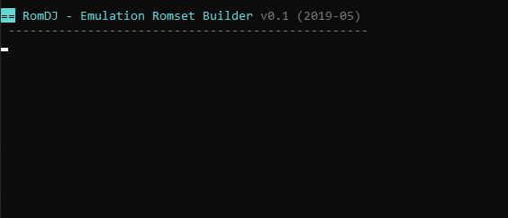
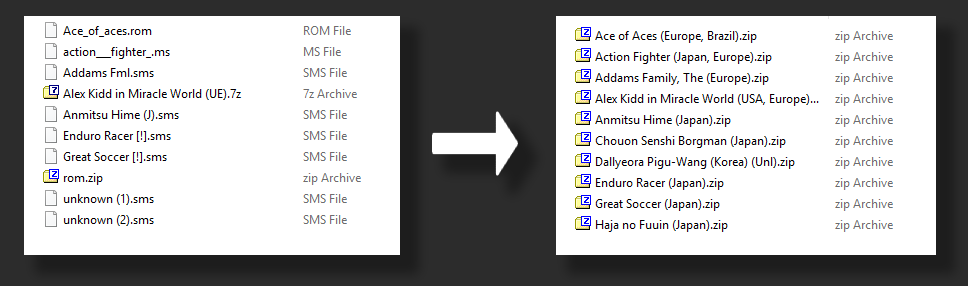

# `romdj`

**Name**: romdj, *Emulation Romset Builder*   
**Author:** John Dimi :computer:, <johndimi@outlook (.) com> *twitter*: [@jondmt](https://twitter.com/jondmt)  
**Project Page and Sources:** [https://github.com/johndimi/romdj](https://github.com/johndimi/romdj)  
**Language:** HAXE compiled to Node.js  
**Version:** 0.3.2 **Platform:** Windows Terminal  

## :mega: What is it

**romdj** is a **CLI** tool to **organize/verify emulation roms** using **No-Intro** database (.dat) files.

> No-Intro database files provide a list of known good rom dumbs also they follow a consistent naming pattern for rom files. You can get no-intro dat files from https://datomatic.no-intro.org/

**What it can do:**  

- Scan a folder for rom  and **BUILD properly named** roms in an output folder.
- Build roms inside archives (**.zip .7z**), or **raw** files *(e.g. game.rom)*
- Can read/process roms from within archives *(zip,7z)*
- **Scan** a folder to find out which roms you are missing for a no-intro full-set  (*`-report` parameter*)

  

**More Details**

- Runs on **NodeJS**, built with **HAXE** *(https://haxe.org)*.
- It uses `stdio` pipes for all archive operations so **no temp files** are created anywhere.
- Can process each input file in **parallel**, so the more threads the faster *(set with parameter -p)*.
- :star: Supports skipping the header portion on files *(Works with the NES no-intro set)*
- Supports reading archives with **multiple roms** inside them.
- Scans all files in an input dir *(except common extensions, like images and executables)*, and **checks file checksum** against the database, so it can **identify rom files** no matter their name or extension.
- :exclamation: Currently **does not support** processing .dat files with entries with more than one file. (*e.g. PSP* )

  
> Visual Example: Rom files will be identified, and then created with proper names to a format of your choice *(zip,7z or raw)*

## :construction_worker: ​INSTALLING

You need to have **NodeJS** and **npm** installed on your system  
Get here : https://nodejs.org/

From a terminal run this command `npm install -g romdj`   
, this will install romdj **globally** and you can run it from anywhere

## :running:RUNNING

`romdj -help` to display basic help

The first parameter romdj expects is an **OPERATION ID**,   
The second parameter is the path to a valid **no intro .DAT** file  

> `romdj <ACTION> <DAT FILE>`   

Currently there are **(2)** **operations** romdj can perform :

:wrench:**BUILD** a Rom Set `build`  
You need to also specify an **input dir** where rom files are for the system the .dat file describes  
, and you need to specify an **output dir**, where the new rom files will be created  

> Set input dir with `-i`  , Set output dir with `-o`  
> **e.g.** `romdj build c:\dats\nintendo.dat -i c:\games\nintendo_random -o c:\games\nintendo_fixed`

:mag:**SCAN** a Rom Set: `scan`  
This operation just needs an **input folder** `-i` to be set. The program will scan the input against the .dat file and report information.  

> **e.g.** `romdj scan c:\dats\nintendo.dat -i c:\games\nintendo_random`

### :hammer:**Parameters**  
You can customize the process by declaring some extra parameters:  

- **Compression** `-c ARCHIVER : LEVEL`   
  Build the roms inside an archive, Supported formats : **zip, 7zip**  
  `ARCHIVER` : `7Z` or `ZIP` ,  
  `LEVEL` : `0-9` *(0 is low compression, faster, 9 is best compression slower)*  
  
  > **e.g.**  
  > `-c ZIP:9` => Compress roms to a ZIP with maximum compression  
  > `-c 7Z:0` => Compress roms to a 7zip with lowest compression  
  > `without -c option` => Builds roms to their native extension (e.g. `.gb`)

- **Delete Source** `-delsrc`  
  On build operation, will delete the source files after they have been created to target dir.  
  
  > :point_right: If source file is archive with multiple files. It will only be deleted if all of its included files were built
  
- **Create Report File** `-report`  
  After the process completes,  this will create a `.txt` report file with more detailed information on the operations. *(List of files copied, duplicates, read errors, skipped, etc )*   

  > :point_right:  The report file is auto-named based on date. On `build` it will be created on the target folder On `scan` it will be created on the source folder.

- **Parallel Tasks** `-p NUM`  
  `NUM`: Number of maximum parallel tasks. From 1 and up. *(If not set default = 2)*   

  > :warning: Don't set this higher than the number of your physical cores.

- **Filter: Prioritize Countries (Region Keep)** `-regkeep X,Y,Z`  
  `X,Y,Z`: Country Codes to prioritize/keep on the filenames. Comma Separated Values.  
  Country codes not declared will be removed from the filename **only if** a country you set is present.
  You can use `=` as a parameter to use the defaults `EUROPE,USA`  
  
  > :point_down: *More examples on how this works further below*  
  
- **:star: Filter: Remove Countries (Region Delete)** `-regdel X,Y,Z`   
  `X,Y,Z`: Country Codes to remove from the filenames. Comma Separated Values.  
  You can use `=` as a parameter to use the defaults `EUROPE,USA,WORLD`   
  
  > e.g.`-regdel EUROPE` ➡ ` "Aladdin (EUROPE,USA)"` ➡`Aladdin (USA)`
  
- **Remove Language Codes** `-nolang`  
  Removes language codes from the filenames.   

  > e.g. `"World Cup USA 94 (Europe, Brazil) (En,Fr,De,Es,It,Nl,Sv)"` ➡  
  > `"World Cup USA 94 (Europe, Brazil)"`

- **Skip Header** `-header N`  
  Skip `N` bytes from the beginning of the files when checking for checksums.   

  > :point_down: *Check below for more info*

- **No Deep Scan** `-nods`  
  Do not scan subfolders in the <input> folder. It can be useful sometimes.

----

### :baby_chick: Prioritize Country Codes `-regkeep`

Some no-intro rom names include multiple countries, like *"Action Fighter (USA, Europe, Brazil) (Rev 1)"*  
You can use the `-regkeep` parameter to keep desired codes while removing unwanted country codes from the name.   
`-regkeep europe : "Game (Europe,USA,Australia)" == "Game (Europe)"`  
If a prioritized country doesn't exist in the name, then nothing is changed  
`-regkeep europe : "Game (Korea)" == "Game (Korea)"`  
You can use multiple country codes (comma separated)  
`-regkeep europe,usa` to keep all of the declared countries  
`-regkeep europe,brazil ➡ "Game (Europe,Usa,Brazil,Australia) ➡ "Game (Europe,Brazil)"`  
You can use `=` to use the default country codes `Europe,USA`  

> :grey_exclamation: You can also use `-regdel` to force remove country codes from filenames

### :baby_chick: Skipping Header bytes

To properly check against some no-intro sets, the header part of the rom needs to be skipped. You can pass the `-header X` parameter to tell romdj to skip the first X bytes when checking for checksums.

> In my knowledge, the **NES** no-intro set is without headers. The NES rom header is 16 bytes so you need to pass `-header 16` when working with NES roms.

## :paperclip: NOTES

This is a first release, and even though I tested for bugs and possible errors, some might have slipped, if you encounter anything not working right, please let me know !  
Also feel free to give feedback and make suggestions on how this program could be improved.

**FUTURE PLANS**

- Support for multiple files per Entry
- Linux

----

Thanks for checking this out, 
John.

:smile: *Buy me a beer [https://www.paypal.me/johndimi](https://www.paypal.me/johndimi)*